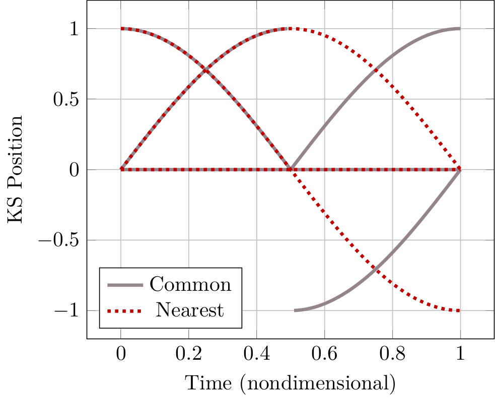
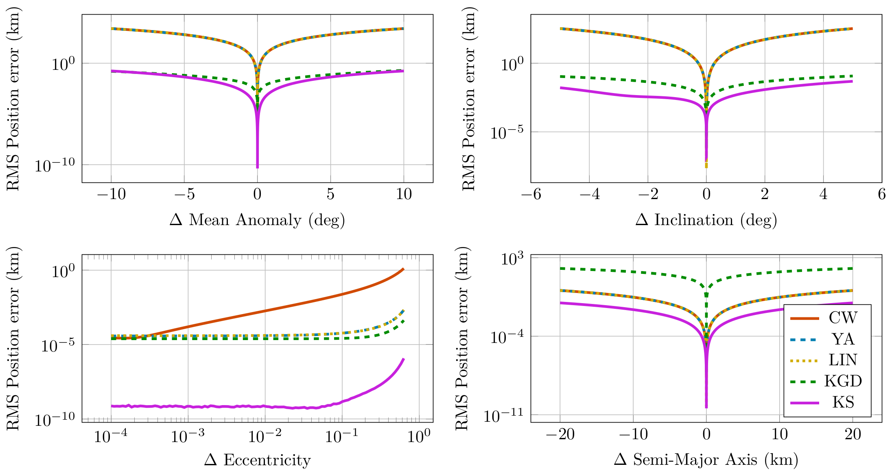

# KSRelativeOrbits
Implementation of results in the 2023 IEEE Aerospace Paper "Convex Optimization of Relative Orbit Maneuvers Using the Kustaanheimo-Stiefel Transformation" by Jacob Willis and Zachary Manchester.


## Organization
* `data`: all data generated and used for figures in the paper
* `figs`: contains `.tikz` and `.png` figures
* `scripts`: scripts for running experiments and generating plots used in the paper
* `src`: libraries for many of the methods and algorithms used in the paper. These are used by running the files in `scripts`.

## Usage
Activate this as a julia package. This is tested on Julia v1.7.2. In a julia REPL:
```
julia> ]
(KSRelativeOrbits) pkg> activate .
```

There are six scripts in `scripts`. Three run experiments and generate data that is saved in `data`, the other three generate corresponding plots from that data. Run the script in the julia REPL:
```
julia> include("scripts/SCRIPT_NAME.jl")
```

The scripts and related figures are shown below for reference.

## Figure 1: Cartesian to KS transform smoothness


```
julia> include("scripts/cart_to_ks_transform_smoothness.jl")
julia> include("scripts/plot_cart_to_ks_transform_smoothness.jl")
```

## Figure 2: RMS position error comparisons


```
julia> include("scripts/rms_trajectory_error_comparison.jl")
julia> include("scripts/plot_rms_trajectory_error_comparison.jl")
```

## Figure 3: Low thrust rendezvous maneuver


```
julia> include("scripts/low_thrust_rendezvous_perturbed.jl")
julia> include("scripts/plot_low_thrust_rendezvous.jl")
```


# Citation:
```
@inproceedings{willis_ks_transform_2023,
    title={{Convex Optimization of Relative Orbit Maneuvers Using the Kustaanheimo-Stiefel Transformation}},
    author={Willis, Jacob B and Manchester, Zachary},
    booktitle={2023 IEEE Aerospace Conference},
    year={2023},
    organization={IEEE}
}
```